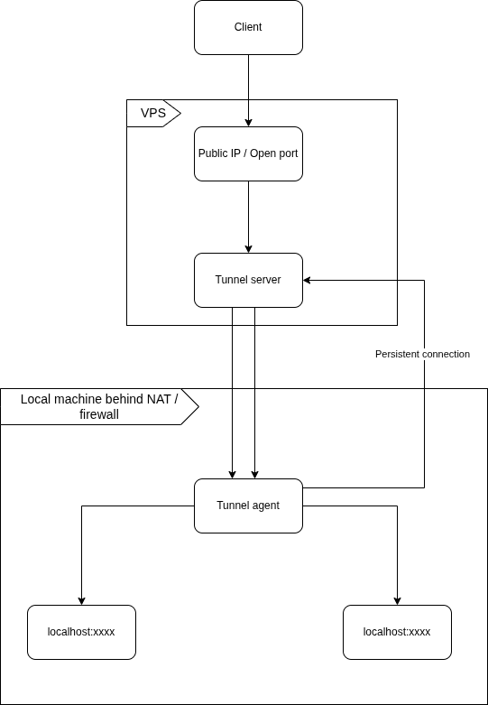

# Requirements
Allow a service running on a machine behind NAT to be reachable from the public internet through a VPS. Without needing a static IP and port forwarding.
- ## Functional Requirements
	- ### MVP
		- A tunnel agent running on the local machine must be able to connect to the tunner server
		- The agent should maintain a long lived connection to the server
		- The agent should be persistent and recoonect if it is dropped
		- The agent should connect to a local service and expose it
		- Inject http request from vps to the tunnel
			- A user accesses `https://music.example.com` and gets a response from `localhost:8096`
		- Support multiple concurrent http requests with stream multiplexing
		- Support subdomain / hostname based routing
            - ```
			  music.example.com  -> tunnel A
			  git.example.com -> tunnel B
			  api.example.com    -> tunnel C
			  ```

# Design
## HLD
